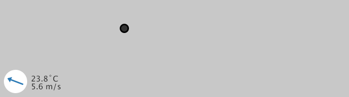

# processing-netcdf
**Simple access to scientific datasets with Processing**

- Thin wrapper around the [Unidata NetCDF Java library](https://www.unidata.ucar.edu/software/thredds/current/netcdf-java/documentation.htm).
- Friendly API for scientific file formats and remote access protocols.
- GRIB 1/2, HDF 4/5, NetCDF 3/4, OPeNDAP, and [many more](https://www.unidata.ucar.edu/software/thredds/current/netcdf-java/reference/formats/FileTypes.html).
- Still early days. Things will break.

## Example
The following example loads weather data from the Unidata Test THREDDS Data Server,
then displays surface wind velocity and temperature. Visualization gratefully
borrowed from the [p5.js weather example](https://p5js.org/examples/hello-p5-weather.html).



```java
import netcdf.PDataset;

PDataset data;
PVector position;
PVector wind;
String temp, wspd;

void setup() {
  size(720, 200);

  data = new PDataset(this);
  String url = "https://thredds-jumbo.unidata.ucar.edu/thredds/dodsC/grib/HRRR/CONUS_3km/surface/TwoD";
  data.openFile(url);
  data.readData("u-component_of_wind_height_above_ground", "0:1,0:1,0:1,0:1,0:1", "u");
  data.readData("v-component_of_wind_height_above_ground", "0:1,0:1,0:1,0:1,0:1", "v");
  data.readData("Temperature_surface", "0:1,0:1,0:1,0:1", "t");

  float u = data.get("u").getFloat(0);
  float v = data.get("v").getFloat(0);
  float t = data.get("t").getFloat(0);

  position = new PVector(width/2, height/2);
  wind = new PVector(u, v);
  temp = String.format("%.1f˚C", t - 272.15);
  wspd = String.format("%.1f m/s", wind.mag());

  data.close();
}

void draw() {
  background(200);

  pushMatrix();
  // Display temperature and windspeed
  textSize(16);
  text(temp, 64, height - 32);
  text(wspd, 64, height - 16);

  translate(32, height - 32);
  // Rotate by the wind's angle
  rotate(wind.heading() + PI/2);
  noStroke();
  fill(255);
  ellipse(0, 0, 48, 48);

  stroke(45, 123, 182);
  strokeWeight(3);
  line(0, -16, 0, 16);

  noStroke();
  fill(45, 123, 182);
  triangle(0, -18, -6, -10, 6, -10);
  popMatrix();

  // Move in the wind's direction
  position.add(wind);

  stroke(0);
  fill(51);
  ellipse(position.x, position.y, 16, 16);

  if (position.x > width)  position.x = 0;
  if (position.x < 0)      position.x = width;
  if (position.y > height) position.y = 0;
  if (position.y < 0)      position.y = height;
}
```
<a rel="license" href="http://creativecommons.org/licenses/by-nc-sa/4.0/"></a><br />This example is licensed under a <a rel="license" href="http://creativecommons.org/licenses/by-nc-sa/4.0/">Creative Commons Attribution-NonCommercial-ShareAlike 4.0 International License</a>.
